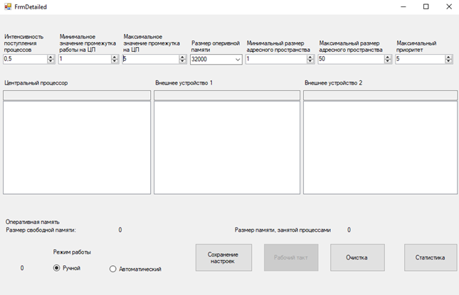
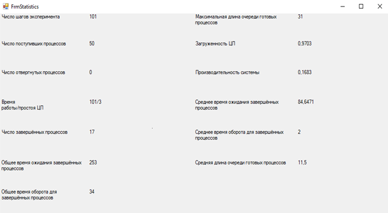

# OS Model (CPU Scheduling Simulation)
Project aims to develop a comprehensive simulation model for an operating system that uses simplified algorithms to manage tasks, devices, and memory efficiently. The program will include an intuitive graphical user interface that allows users to customize system settings and track real-time statistics, improving the overall user experience.

## Interface demo
### Settings window

### Statistics window

